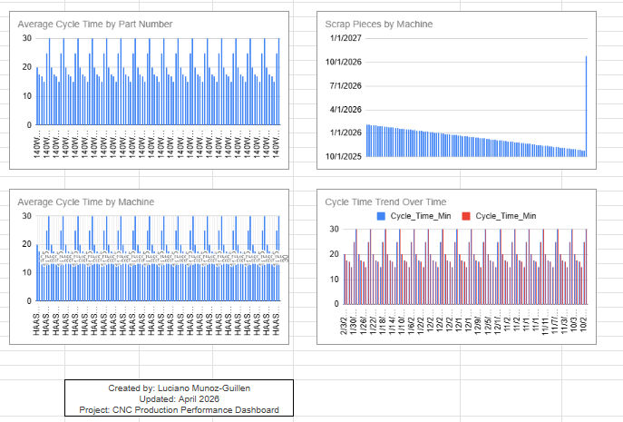

CNC Production Performance Dashboard:

A fully interactive manufacturing analytics dashboard built in Google Sheets, designed to simulate real CNC machining operations and provide actionable insights into production efficiency, scrap performance, and operator behavior.
This project reflects real‑world aerospace manufacturing workflows and demonstrates the analytical skills required for data roles at companies like Boeing, Blue Origin, and SpaceX.

Project Overview

This dashboard analyzes CNC machining performance using a realistic, hand‑crafted dataset that includes:

-Cycle times

-Scrap pieces

-Total pieces produced

-Operator performance

-Machine IDs

-Production dates

-The dashboard uses dynamic slicers, KPI cards, and interactive charts to help users explore production trends and identify inefficiencies.

Dashboard Features:

Dynamic Slicers

Filter the entire dashboard by:

-Operator

-Cycle time

-Total pieces produced

KPI Cards

-Automatically updating metrics:

-Average cycle time

-Minimum & maximum cycle time

-Total pieces produced

-Scrap rate (fully dynamic)

Interactive Charts

Visualizations update instantly based on slicers:

-Cycle time trends

-Scrap performance

-Production output

Clean Dashboard Layout

-Title bar

-KPI row

-Filter panel

-Chart grid

-Footer with author + update timestamp

Hidden Data Engine

The filtered dataset is stored out of view to keep the dashboard clean and professional.

Skills Demonstrated

This project showcases:

-Data cleaning & preparation

-KPI design & calculation

-Manufacturing analytics

-Google Sheets formulas (QUERY, FILTER, IFERROR, etc.)

-Dashboard layout & UX design

-Data visualization

-Realistic dataset modeling

-Problem‑solving under real constraints

Tech Stack

-Google Sheets (primary tool)

-QUERY + FILTER + IFERROR

-Slicers

-Charts

-Custom dataset

Live Dashboard
👉 Google Sheets Link:  
https://docs.google.com/spreadsheets/d/10qg0DVIptNPS8fzUXda0OKYjMLFtcY20dh9GE6kgPqI/edit?usp=sharing

cnc-production-dashboard/
│
├── README.md
├── dashboard.png
└── (optional) dashboard.pdf

Author
Luciano Munoz‑Guillen  
CNC Machinist → Data Analytics Transition
Seattle, WA

Focused on aerospace manufacturing analytics, data‑driven process improvement, and building portfolio projects that reflect real production environments.

Last Updated
April 17th, 2026

